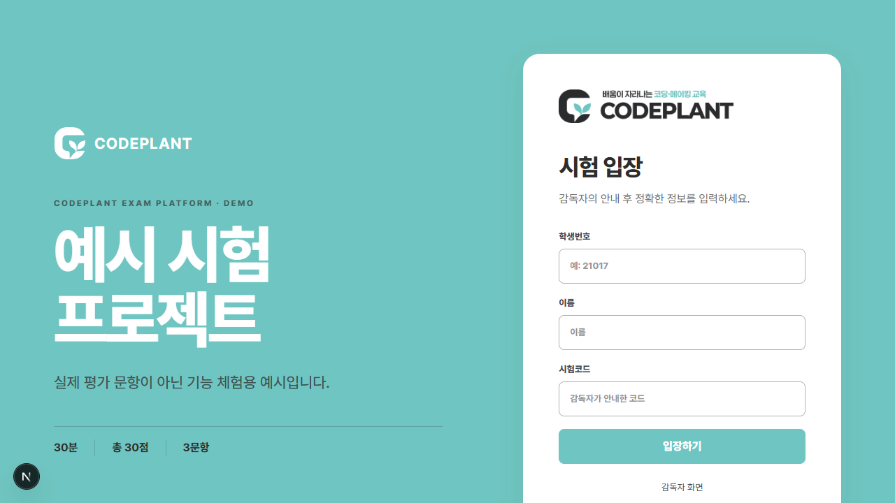
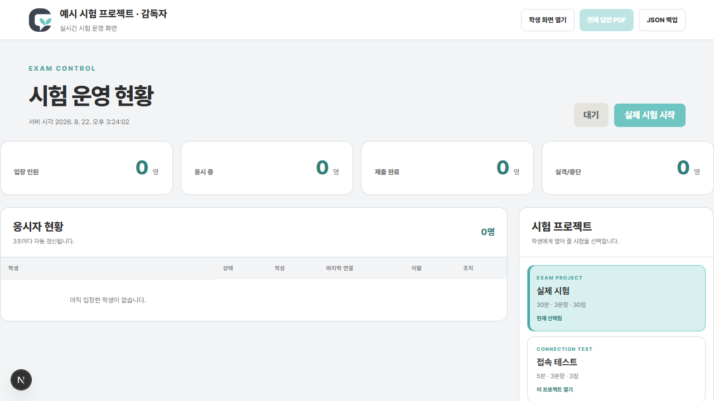
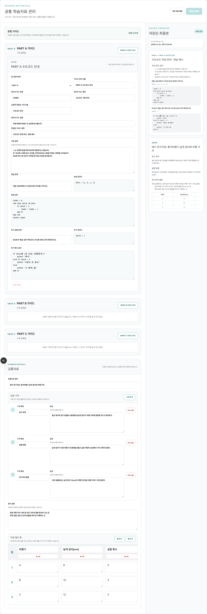
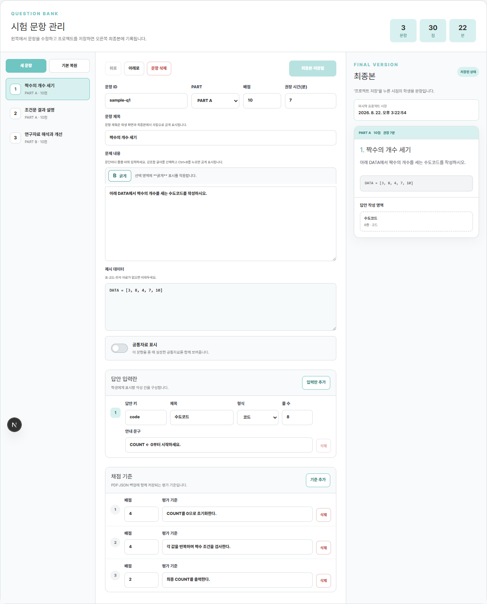

# CODEPLANT 공개 프로그램 및 스킬

학교·교육기관에서 수정하여 사용할 수 있는 공개 프로그램과 Codex 스킬 모음입니다. 첫 공개 버전에는 웹 시험 운영 예시와 한국어 문서 업무 스킬을 담았습니다.

> 공개판에는 특정 학교의 실제 시험문제, 학생 답안, 관리자 암호가 포함되어 있지 않습니다. 화면과 기능을 이해할 수 있도록 새로 만든 예시문제만 제공합니다.

## 바로 체험하기

- 학생 예시 화면: <https://codeplant-exam-platform.vercel.app/>
- 관리자 화면: <https://codeplant-exam-platform.vercel.app/admin>

관리자 암호는 공개 저장소에 적지 않습니다. 직접 배포할 때 Vercel의 `ADMIN_PIN` 환경변수로 설정하십시오.

## 들어 있는 항목

| 경로 | 내용 |
|---|---|
| `apps/exam-platform-vercel` | Vercel + Turso 기반 시험 운영 웹앱 |
| `skills/codeplant-korean-workflows` | 한국어 교육·학교·공공 문서 업무 통합 스킬 |
| `skills/organize-meeting-minutes` | 로컬 전사 우선 회의록 정리 스킬 |
| `docs/images` | 학생·관리자 실제 실행 화면 |

## 화면 미리보기

### 학생 입장



### 관리자 운영 화면



### PART A·B·C 가이드 편집



### 문항 편집과 최종본 저장



## 주요 기능

- 실제 시험과 접속 테스트를 별도 프로젝트로 관리
- 시험 표지, 시간, 코드, 문항, 배점, 답안 칸을 관리자 화면에서 수정
- PART A·B·C별 가이드 추가·삭제와 모든 표시 이름 수정
- 공통자료 본문 구역과 자유 형식 표의 행·열 추가·삭제
- 학생 답안 자동 저장, 문항 이동, 제출, 초점 이탈 경고 기록
- 관리자 대기자 확인, 시험 시작·종료, 학생 상태 확인
- 학생별 답안 PDF와 전체 JSON 백업
- 모바일·아이패드 화면 대응

## 방법 1: Codex로 실행하기

Codex에 아래처럼 요청하면 저장소 확인부터 로컬 실행 또는 Vercel 배포까지 진행할 수 있습니다.

```text
이 저장소의 README와 apps/exam-platform-vercel/.env.example을 읽고,
공개 예시 시험 웹앱을 로컬에서 실행해 검수해 줘.
실제 운영 배포가 필요하면 Vercel 프로젝트와 Turso 데이터베이스를 연결하되,
환경변수나 관리자 암호는 저장소에 커밋하지 말고 배포 후 학생/관리자 화면을 확인해 줘.
```

Vercel 배포까지 요청할 때는 Codex가 외부 서비스 약관 승인이나 로그인을 요구할 수 있습니다. 그 단계만 사용자가 직접 승인하면 나머지 검수와 배포를 이어갈 수 있습니다.

## 방법 2: GitHub에서 받아 직접 실행하기

### 준비물

- Node.js 20.9 이상
- Git
- 로컬 실행만 할 경우 별도 데이터베이스 계정은 필요하지 않음
- 인터넷에 배포할 경우 Vercel 계정과 Turso 데이터베이스

### 로컬 실행

```powershell
git clone https://github.com/CodeplantEDU/codeplant-public-programs-and-skills.git
cd codeplant-public-programs-and-skills/apps/exam-platform-vercel
npm install
Copy-Item .env.example .env.local
```

`.env.local`을 다음처럼 수정합니다.

```dotenv
TURSO_DATABASE_URL=file:local.db
ADMIN_PIN=YOUR_4_TO_12_DIGIT_PIN
```

관리자 암호는 숫자 4~12자리로 바꾸십시오. 그다음 실행합니다.

```powershell
npm run dev
```

- 학생 화면: `http://localhost:3000`
- 관리자 화면: `http://localhost:3000/admin`
- 기본 시험코드: `AI2026`

### Vercel 배포

1. `apps/exam-platform-vercel` 폴더를 Vercel 프로젝트로 연결합니다.
2. Vercel Marketplace에서 Turso 데이터베이스를 연결합니다.
3. Vercel 프로젝트 환경변수에 `ADMIN_PIN`을 숫자 4~12자리로 추가합니다.
4. Production으로 배포합니다.

CLI를 사용할 때의 예시는 다음과 같습니다.

```powershell
cd apps/exam-platform-vercel
npx vercel link
npx vercel integration add tursocloud/database --plan starter -e production -e preview -e development
npx vercel env add ADMIN_PIN production --sensitive
npx vercel --prod
```

Turso 연동 시 `TURSO_DATABASE_URL`, `TURSO_AUTH_TOKEN`은 연동이 완료된 Vercel 프로젝트에 자동으로 제공됩니다. 비밀값은 `.env.local`이나 Vercel 환경변수에만 두고 GitHub에 커밋하지 마십시오.

## 관리자 사용 순서

1. 관리자 화면에서 접속 테스트 프로젝트를 선택합니다.
2. 학생들이 접속 테스트 대기자 목록에 모두 보이는지 확인합니다.
3. 접속 테스트를 시작하고 입력·문항 이동·제출을 확인한 뒤 테스트를 종료합니다.
4. 실제 시험 프로젝트를 선택하고 표지, 시간, 문항, 가이드, 공통자료를 저장합니다.
5. 실제 시험 대기자를 모두 확인한 후 `실제 시험 시작`을 누릅니다.
6. 시험이 끝나면 `시험 종료`를 누릅니다.
7. `전체 답안 PDF`를 내려받고 `JSON 백업`도 함께 보관합니다.

## 학생 유의사항

- 문항 번호를 누르면 해당 문항으로 이동합니다.
- 답안은 입력 중 자동 저장됩니다.
- 시험 페이지 밖의 화면이나 다른 앱을 누르면 초점 이탈로 기록될 수 있습니다.
- F5, 브라우저 새로고침, 모바일 화면을 아래로 당겨 새로고침하는 동작을 하지 않습니다.
- 마지막 문항까지 확인한 뒤 `최종 제출`을 누릅니다.

## Codex 스킬 설치

필요한 스킬 폴더를 사용자의 Codex 스킬 폴더로 복사합니다.

```powershell
Copy-Item skills/codeplant-korean-workflows "$HOME/.codex/skills/codeplant-korean-workflows" -Recurse
Copy-Item skills/organize-meeting-minutes "$HOME/.codex/skills/organize-meeting-minutes" -Recurse
```

사용 예시:

```text
$codeplant-korean-workflows 를 사용해서 이 HWPX 교육결과보고서를 원본 양식을 보존해 작성하고 검증해 줘.
```

```text
$organize-meeting-minutes 를 사용해서 첨부 녹음을 로컬에서 전사한 뒤 회의별 결정사항과 액션 아이템을 정리해 줘.
```

## 보안과 운영상 한계

웹의 초점 이탈 감지는 감독을 돕는 기록 기능입니다. 브라우저만으로 다른 기기 사용이나 모든 부정행위를 완전히 차단할 수는 없습니다. 중요한 시험은 현장 감독, 아이패드 사용법 사전 안내, 네트워크 점검, 접속 테스트를 함께 운영하십시오.

실제 시험문제를 공개 저장소에 넣지 마십시오. 운영 기관은 비공개 저장소 또는 관리자 화면에서 별도로 입력하고, 시험 전 PDF·JSON 백업과 복구 절차를 확인해야 합니다.

## 검증

```powershell
cd apps/exam-platform-vercel
npm test
npm run lint
npx tsc --noEmit
npm run build
```

## 라이선스

코드는 [MIT License](LICENSE)로 공개합니다. 로고와 브랜드 자산의 상표권은 각 권리자에게 있습니다.
