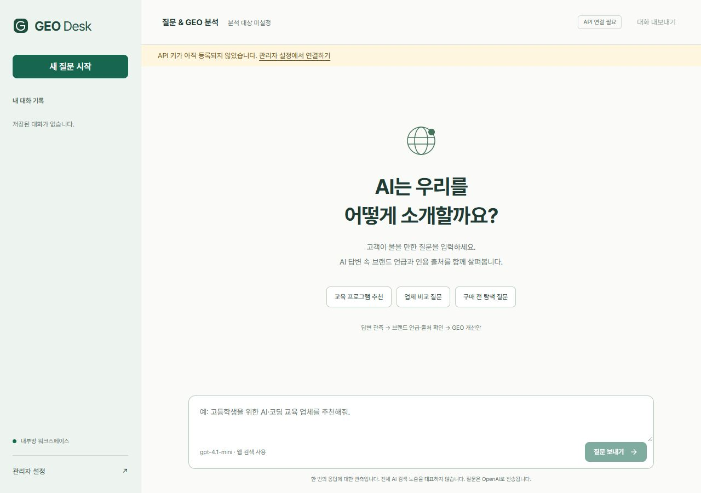

# CODEPLANT GEO Desk

OpenAI API로 질문에 답하고, 답변 안에서 브랜드가 언급되거나 공식 사이트가 인용되는지 살펴보는 **Windows 내부망용 채팅 프로그램**입니다. GEO는 Generative Engine Optimization(생성형 AI 검색 최적화)을 의미합니다.

관리자가 로그인하여 API 키와 분석 대상을 한 번 저장하면, 같은 내부망의 사용자는 키를 직접 입력하지 않고 질문할 수 있습니다. 외부 Python 패키지·Node.js·CDN 없이 실행합니다.



## 기능

- 질문 채팅, 후속 질문, 새 대화, 브라우저별 대화 기록
- OpenAI Responses API와 선택 가능한 웹 검색
- 지정한 브랜드의 언급 횟수와 공식 사이트의 고유 인용 출처 수 표시
- 실제 답변을 근거로 별도 GEO 분석 및 개선안 생성
- 클릭 가능한 인용 출처와 대화 TXT 내보내기
- 관리자 로그인, API 키·모델·브랜드·사이트·하루 질문 한도 설정
- Windows DPAPI를 이용한 API 키 암호화 저장
- 관리자 비밀번호 변경, 저장된 키 연결 확인·삭제
- SQLite에 설정·대화 저장: 프로그램을 다시 실행해도 유지
- 데스크톱·모바일 화면 대응

## 준비물

- Windows 10 또는 11
- Python 3.12 이상: `python --version`으로 확인
- Git 또는 이 저장소의 ZIP 다운로드
- OpenAI API 키와 해당 모델에 대한 API 접근 권한
- 서버 PC의 인터넷 연결: 실제 질문은 OpenAI API로 전송됩니다.

이 프로그램은 Windows의 DPAPI를 사용하므로 macOS·Linux에서 그대로 실행하는 프로그램이 아닙니다. 실행 파일(EXE)은 포함하지 않고 Python 소스를 제공합니다.

## 빠르게 실행하기

일반 Windows PowerShell에서 실행합니다.

```powershell
git clone https://github.com/CodeplantEDU/codeplant-public-programs-and-skills.git
Set-Location .\codeplant-public-programs-and-skills\apps\geo-desk
powershell -ExecutionPolicy Bypass -File .\start.ps1
```

- 질문 페이지: <http://localhost:8766/>
- 관리자 페이지: <http://localhost:8766/admin>

`start.ps1`은 숨김 백그라운드 프로세스로 실행합니다. PC를 재부팅한 뒤에는 다시 실행해야 하며, 자동 시작이나 방화벽 규칙을 등록하지 않습니다.

다른 포트를 쓰려면 다음과 같이 실행합니다.

```powershell
powershell -ExecutionPolicy Bypass -File .\start.ps1 -Port 8770
```

터미널에서 로그를 보며 직접 실행할 수도 있습니다. 이 방식은 `Ctrl+C`로 종료합니다.

```powershell
python -u server.py --host 127.0.0.1 --port 8766
```

`--host 127.0.0.1`은 해당 PC에서만 접속하는 구성입니다. 내부망 사용자는 기본 실행기 또는 `--host 0.0.0.0`으로 실행한 서버에 접속합니다.

## 첫 관리자 설정

1. 관리자 페이지를 엽니다.
2. ID `admin`으로 로그인합니다. **초기 비밀번호는 최초 실행 때 무작위로 생성**되며 `data/admin-login.txt`에 저장됩니다.
3. OpenAI API 키와 모델 ID를 입력하고 `설정 저장`을 누릅니다. 기본 모델 ID는 `gpt-4.1-mini`입니다. 다른 모델은 해당 계정에서 이용 가능한 Responses API 모델 ID를 입력합니다.
4. `저장된 키 연결 확인`으로 키 인증과 모델 목록 접근을 확인합니다.
5. 브랜드·회사명과 공식 웹사이트 전체 주소를 입력합니다. 예: `예시 교육기관`, `https://example.com`.
6. 웹 검색 사용 여부와 하루 질문 한도를 설정합니다.
7. 관리자 비밀번호를 원하는 비밀번호로 변경합니다. 12자 이상이며, 변경하면 기존 관리자 세션이 만료되어 다시 로그인해야 합니다.
8. 질문 페이지에서 첫 질문을 실행하여 실제 답변과 웹 검색 권한까지 확인합니다.

키 연결 확인 성공은 실제 모델 응답·웹 검색·결제 상태의 모든 조건을 검증했다는 뜻은 아닙니다. 실제 질문을 한 번 완료해야 해당 경로까지 확인됩니다.

저장된 키는 화면에 원문으로 다시 표시하지 않습니다. API 키 입력칸을 비워 둔 채 설정을 저장하면 기존 키가 유지되며, `키 삭제`를 눌러야 삭제됩니다.

## 같은 내부망에서 사용하기

서버 PC에서 `ipconfig`를 실행하고 현재 사용하는 이더넷 또는 Wi-Fi의 IPv4 주소를 확인합니다. 다른 기기의 브라우저에서 `http://서버PC의IPv4주소:8766/`에 접속합니다.

예를 들어 서버 IP가 `192.168.1.100`이면 주소는 `http://192.168.1.100:8766/`입니다. **이 주소는 설명용 예시**이며 실제 PC 주소로 바꿔야 합니다. 서버 시작 시 해당 PC에 할당된 IP와 호스트 이름을 접속 주소로 허용합니다. IP가 바뀌면 서버를 재실행합니다.

다른 기기에서 연결되지 않으면 같은 네트워크인지, 공유기의 기기 격리 설정이 켜져 있는지, Windows 방화벽에서 해당 Python 프로세스의 TCP 포트를 허용하는지 확인합니다. 필요한 경우 운영자가 **현재 서버 IP·해당 포트·같은 서브넷 범위만** 허용합니다. 네트워크 프로필이 공용인지 개인인지도 확인하세요. 이 프로그램은 방화벽을 자동으로 바꾸지 않습니다.

내부망 페이지는 HTTP입니다. 관리자 로그인·키 입력은 서버 PC의 `localhost`에서 진행하는 것을 권장합니다. 인터넷 공개나 공유기 포트 포워딩은 이 배포 구성의 범위에 포함되지 않습니다.

## 질문과 분석 읽는 방법

고객이 실제로 물을 만한 질문을 입력합니다.

```text
고등학생을 위한 AI 코딩 교육 프로그램을 추천해줘.
```

1. **답변 관측:** 모델에 질문과 이전 대화만 전달해 답변을 받습니다. 관리자가 설정한 브랜드를 첫 답변의 추천 지시문에 자동으로 넣지 않습니다.
2. **기계적 집계:** 지정한 브랜드 문자열을 대소문자 구분 없이 검색해 언급 횟수를 계산하고, 인용 URL의 호스트가 공식 사이트 도메인 또는 그 하위 도메인인지 확인합니다.
3. **GEO 분석:** 그 답변·출처·집계를 다른 API 요청으로 보내 관측 결과와 개선안을 작성합니다.

브랜드명을 질문에 직접 쓰거나 이전 대화에 브랜드가 등장하면 답변에 영향을 줄 수 있습니다. 같은 조건의 독립 질문을 비교할 때는 `새 질문 시작`을 누르세요.

표시하는 언급 횟수는 지정한 문자열의 단순 등장 횟수입니다. 약칭·다른 표기·의미상 언급을 모두 인식하는 수치가 아닙니다. 공식 사이트 인용 수는 고유 URL 수이며, 사이트 콘텐츠의 진위를 별도로 검사한 결과는 아닙니다.

**한 질문의 한 응답에 대한 관측**입니다. 실제 ChatGPT 제품 전체나 다른 AI 검색 서비스의 순위·노출률을 대표하지 않으며, 자동 점수나 시장 점유율을 산출하지 않습니다. 2차 분석이 실패하면 1차 답변은 저장하고 실패 사유를 표시합니다.

## 비용과 저장

질문 한 건당 최대 2회의 모델 호출이 발생하며, 웹 검색을 사용하면 검색 도구 비용이 추가될 수 있습니다. 질문을 한 번 더 보내면 새 API 요청이 발생합니다. 정확한 요금은 [OpenAI API 가격](https://developers.openai.com/api/docs/pricing)을 확인하세요.

하루 질문 한도는 워크스페이스 전체 합계이고 한국 시간 자정 기준입니다. 실패한 시도도 포함합니다. 최대 3건을 동시에 처리하며, 처리 슬롯이 가득 차면 잠시 후 다시 요청하도록 안내합니다.

| 항목 | 저장 방식 |
|---|---|
| API 키 | 현재 Windows 사용자 계정의 DPAPI로 암호화 후 SQLite 저장 |
| 관리자 비밀번호 | salt와 PBKDF2-HMAC-SHA256 해시 저장 |
| 설정·대화 | `data/geo.sqlite3`에 저장 |
| 방문자 식별 | HttpOnly·SameSite 쿠키, 유효 기간 90일 |
| 관리자 세션 | HttpOnly·SameSite 쿠키, 유효 기간 8시간 |
| 실행 로그·PID | `data/server.log`, `data/error.log`, `data/server.pid` |

대화 기록은 방문자 쿠키로 분리됩니다. 같은 브라우저 쿠키를 공유하는 사용자는 같은 방문자로 취급되며, 쿠키를 삭제하면 기존 기록을 그 브라우저에서 다시 볼 수 없습니다. 일반 사용자의 별도 계정 로그인은 없습니다. 내부망 사용자가 관리자 키를 이용해 질문하는 공동 워크스페이스입니다.

`data` 폴더는 개인 운영 데이터입니다. Git에 포함되지 않도록 제외되어 있으며 외부 공유·업로드를 하지 마세요. 다른 Windows 사용자 계정으로 옮기면 DPAPI로 보호한 키를 다시 입력해야 합니다. 운영 데이터 백업은 서버를 종료한 뒤 진행하세요.

API 요청에 `store: false`를 지정합니다. 이것만으로 제공자의 모든 보관·처리 정책이 사라지는 것은 아닙니다. 데이터 처리 조건은 [OpenAI 데이터 제어 안내](https://developers.openai.com/api/docs/guides/your-data)를 확인하세요.

## 종료·재실행

`start.ps1`로 실행한 프로세스만 종료하려면 다음을 실행합니다.

```powershell
powershell -ExecutionPolicy Bypass -File .\stop.ps1
```

실행 PID와 프로세스 명령줄이 이 앱의 `server.py`와 일치하는지 확인한 후 종료합니다. 다른 Python 프로세스를 일괄 종료하지 않습니다. 데이터는 유지됩니다. 다시 `start.ps1`을 실행하면 저장된 설정으로 시작합니다.

## 오류 점검

```powershell
python diagnose_connection.py
```

키 원문이나 프록시 URL을 출력하지 않고 DNS·HTTPS 연결·키 인증·선택 모델의 목록 접근 여부를 확인합니다.

- **연결 거부:** 서버를 시작한 환경의 프록시·네트워크 제한을 확인합니다. 제한된 자동화 환경에서 시작하면 해당 환경의 프록시가 상속될 수 있습니다. 운영자 권한 범위에서 일반 Windows PowerShell로 실행하세요.
- **401:** 관리자 설정에서 API 키를 확인합니다.
- **403:** 키와 모델 접근 권한을 확인합니다.
- **429:** API 사용 한도·호출 제한 또는 앱의 하루 질문 한도를 확인합니다.
- **모델 응답 미완료:** 질문을 줄이거나 계정에서 이용 가능한 모델로 변경합니다.
- **포트 충돌:** 기존 앱을 그대로 두고 이 앱의 `-Port` 값을 변경합니다.

인증서 검증을 끄거나 운영체제 보안 설정을 무작정 비활성화하는 방식은 사용하지 않습니다.

## 테스트

```powershell
python -X utf8 -m unittest test_server -v
```

별도 `test-data` 폴더와 가짜 API 응답을 사용합니다. 실제 OpenAI를 호출하거나 유료 API 비용을 발생시키지 않습니다. 인증·Origin 검사·키 암호화·설정 유지·방문자별 대화 분리·언급 및 인용 집계·비밀번호 변경 시 세션 만료를 확인합니다.

실제 Windows 실행 검증에서는 키 인증·모델 접근, 웹 검색을 포함한 답변, 별도 GEO 분석까지 확인했습니다. 이는 검증 환경의 결과이며 각 설치 환경의 API 계정·네트워크·다른 내부망 기기 연결을 보장하지 않습니다.

## 파일 구성

```text
geo-desk/
  server.py                 HTTP 서버·인증·키 저장·API 연동
  start.ps1                 백그라운드 실행
  stop.ps1                  해당 앱 프로세스만 종료
  diagnose_connection.py    연결 진단
  test_server.py            가짜 API를 이용한 통합 테스트
  static/                   채팅·관리자 HTML/CSS/JavaScript
  docs/images/              비밀값 없는 화면 예시
  data/                     최초 실행 때 생성, Git 제외
  test-data/                테스트 때 생성, Git 제외
```

공개본에는 실제 API 키, 관리자 비밀번호, 대화 데이터베이스, 실행 로그, 특정 PC의 운영 주소가 포함되지 않습니다.

## 라이선스

저장소의 [MIT License](../../LICENSE)를 따릅니다. OpenAI API 이용 조건과 사용 요금은 별도로 적용됩니다.

API 구현 참고: [Responses API 웹 검색](https://developers.openai.com/api/docs/guides/tools-web-search).
